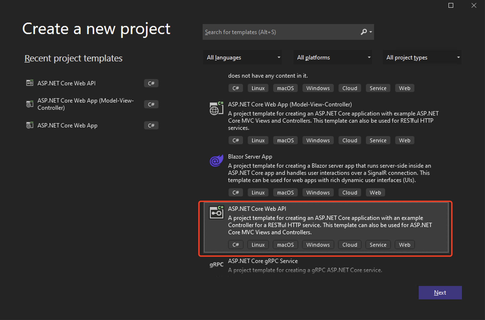
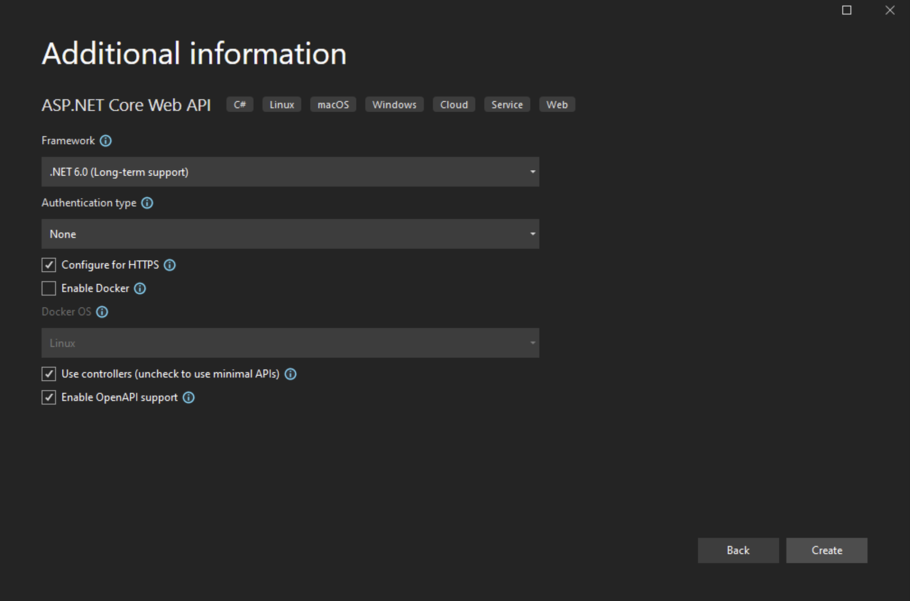
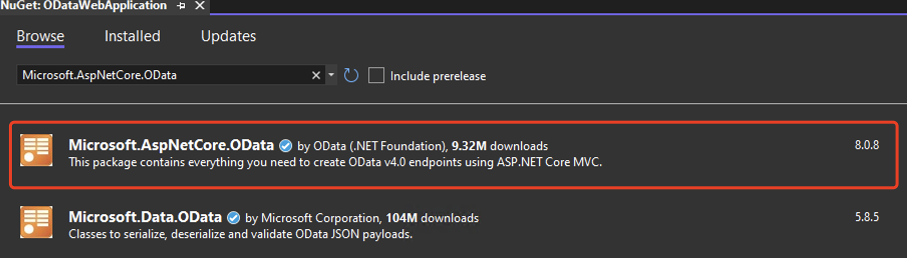

# OData Introduction

> OData - the best way to REST
> An open protocol to allow the creation and consumption of queryable and interoperable RESTful APIs in a simple and standard way.

OData全称为 Open Data Protocol，正如官网[OData](https://www.odata.org/)上所述，OData 是实现 REST 的最好的方式。OData 是一套协议，它定义和提供了一系列标准的建立和使用 RESTful APIs 服务的方法。只要遵循这个协议，那么开发着在建立自己的 RESTful 服务的时候就不用去考虑 API 请求和返回的形式，包括请求参数、请求头、返回的 HTTP 状态、URL 路径格式等等，开发者只需要关注自己服务的业务逻辑。有了这样子的一个 RESTful API 服务的协议，那么服务端开发者以及该服务的调用者，都可以非常简单的进行快速开发和集成，来快速实现功能应用。

OData 能提供非常强大的功能，而且把 OData 集成到我们的服务中也是非常简单的。集成 OData 不会影响我们服务的业务逻辑，它是在业务逻辑之上的一层薄薄的协议。下面通过一个简单的 demo 来展示如何集成和使用 OData。

# OData Practicing

## 环境

1. .Net 6.0
2.  Microsoft.AspNetCore.OData - version = 8.0.8


## 创建项目 Solution
在这个 demo 中，我选择了`ASP.NET Core Web API`来作为这个 demo OData 项目的模版。正如此模版简介，这个项目模版会提供一个 RESTful HTTP service 的 Controller 样例。

在项目创建对话框中选择最新的 C# 开发环境，即 `.NET 6.0`。


当模版项目创建完成后，通过`Manage NuGet Packages`来安装`OData`包，选择最新的版本即可。


## 添加 Model
在`MVC`架构中，`Model`是用来表示存储的数据结构的，并且会在`View`中显示和会在`Controller`中被进行业务逻辑相关的操作和传输。
在`RESTful`的概念中，`Model`是用来定义资源的数据结构的。

定义一个`Employee`的`Model`，命名为`Employee.cs`
```C#
using System.Runtime.Serialization;

namespace ODataWebApplication.Models
{
    public class Employee
    {
        public int Id { get; set; }

        public string Name { get; set; }

        public JobTitle JobTitle { get; set; }

        public Address Location { get; set; }
    }

    public class Address
    {
        public string City { get; set; }

        public string Street { get; set; }
    }

    public enum JobTitle
    {
        [EnumMember(Value = "Software Development Engineer")]
        SDE,

        [EnumMember(Value = "Product Manager")]
        PM,

        Designer,

        Partner,

        Tester,
    }
}
```


## 创建数据仓库服务
创建一个仓库`interface`，命名为`IEmployeeRepository.cs`
```c#
using ODataWebApplication.Models;

namespace ODataWebApplication.Services
{
    public interface IEmployeeRepository
    {
        public IEnumerable<Employee> Employees();
    }
}
```

创建一个`Employee`仓库的实现，为了方便demo，这里就直接存到内存中了。创建一个存储`Employee`的仓库实现，命名为`EmployeeInMemRepository.cs`
```c#
using ODataWebApplication.Models;

namespace ODataWebApplication.Services
{
    public class EmployeeInMemRepository : IEmployeeRepository
    {
        private readonly IList<Employee> employees;

        public EmployeeInMemRepository()
        {
            this.employees = new List<Employee>()
            {
                new Employee(){ Id = 1, Name = "Jay", JobTitle = JobTitle.Partner, Location = new Address() { City = "Beij", Street = "Haid" } },
                new Employee() { Id = 2, Name = "Xia", JobTitle = JobTitle.PM, Location = new Address() { City = "Beij", Street = "Chaoy" } },
                new Employee() { Id = 3, Name = "Yo", JobTitle = JobTitle.SDE, Location = new Address() { City = "Nanj", Street = "Jinl" } },
                new Employee() { Id = 4, Name = "Jin", JobTitle = JobTitle.SDE, Location = new Address() { City = "Nanj", Street = "Qinh" } },
                new Employee() { Id = 5, Name = "Hua", JobTitle = JobTitle.SDE, Location = new Address() { City = "Hen", Street = "Hez" } },
                new Employee() { Id = 6, Name = "Yi", JobTitle = JobTitle.Designer, Location = new Address() { City = "Suz", Street = "Taih" } },
                new Employee() { Id = 7, Name = "Qin", JobTitle = JobTitle.Tester, Location = new Address() { City = "Shan", Street = "Hand" } }
            };
        }

        public IEnumerable<Employee> Employees()
        {
            return this.employees;
        }
    }
}
```
事实上，`OData`有个特点是对数据库透明。即，`OData`专注于定义与调用者直接的形式，而不关心用了什么数据库。

这里的`EmployeeInMemRepository.cs`的功能就是作为数据库来提供数据。

## 依赖注入数据仓库服务

在`Program.cs`中为我们的服务注入依赖的服务，这里是注入我们创建好的数据仓库`IEmployeeRepository`
```c#
using ODataWebApplication.Services;

var builder = WebApplication.CreateBuilder(args);

// Add services to the container.
builder.Services.AddScoped<IEmployeeRepository, EmployeeInMemRepository>();
```

## 添加 OData 协议
同样在`Program.cs`中添加`OData`协议。
1. 第一步，将`MVC`中的`Model`转换成符合`OData`协议的数据结构，即实体数据模型（Entity Data Model, EDM）。
2. 第二步，将建立好的实体数据模型`EDM`添加到`Controller`中以`odata`为终结点的路由。
3. 第三步，为`Controller`启用所有`OData`协议中的请求功能，比如`$count`, `$orderby`, `$select`, `$top`, `$skip`, `$expand`, `$filter`.
```c#
using Microsoft.AspNetCore.OData;
using Microsoft.OData.ModelBuilder;

var modelBuilder = new ODataConventionModelBuilder();
modelBuilder.EntitySet<Employee>("Employees");

builder.Services.AddControllers().
    AddOData(opt => opt.EnableQueryFeatures()
    .AddRouteComponents("odata", modelBuilder.GetEdmModel()));
```

## 创建 Controller
在`Controllers`文件夹中创建`EmployeesController.cs`，来控制`Employee` `Model`，并且创建`Employee`资源相关的`RESTful APIs`。

```c#
using Microsoft.AspNetCore.Mvc;
using Microsoft.AspNetCore.OData.Query;
using ODataWebApplication.Services;

namespace ODataWebApplication.Controllers
{
    public class EmployeesController : Controller
    {
        private IEmployeeRepository repository;

        public EmployeesController(IEmployeeRepository repository)
        {
            this.repository = repository;
        }

        [EnableQuery]
        public IActionResult Get()
        {
            return Ok(this.repository.Employees);
        }
    }
}
```

## 运行
运行项目，并且在Postman中测试`OData`。

### $metadata
请求以下API，会返回所有数据仓库中的`Employee`数据。
```
https://localhost:7240/odata/Employees
```
```json
{
    "@odata.context": "https://localhost:7240/odata/$metadata#Employees",
    "value": [
        {
            "Id": 1,
            "Name": "Jay",
            "JobTitle": "Partner",
            "Location": {
                "City": "Beij",
                "Street": "Haid"
            }
        },
        {
            "Id": 2,
            "Name": "Xia",
            "JobTitle": "PM",
            "Location": {
                "City": "Beij",
                "Street": "Chaoy"
            }
        },
        {
            "Id": 3,
            "Name": "Yo",
            "JobTitle": "SDE",
            "Location": {
                "City": "Nanj",
                "Street": "Jinl"
            }
        },
        {
            "Id": 4,
            "Name": "Jin",
            "JobTitle": "SDE",
            "Location": {
                "City": "Nanj",
                "Street": "Qinh"
            }
        },
        {
            "Id": 5,
            "Name": "Hua",
            "JobTitle": "SDE",
            "Location": {
                "City": "Hen",
                "Street": "Hez"
            }
        },
        {
            "Id": 6,
            "Name": "Yi",
            "JobTitle": "Designer",
            "Location": {
                "City": "Suz",
                "Street": "Taih"
            }
        },
        {
            "Id": 7,
            "Name": "Qin",
            "JobTitle": "Tester",
            "Location": {
                "City": "Shan",
                "Street": "Hand"
            }
        }
    ]
}
```

此请求除了把数据仓库中的所有数据返回，还返回一个集成`OData`之后特有的属性`@odata.context`，
```
"@odata.context": "https://localhost:7240/odata/$metadata#Employees"
```
该属性可以让`API`调用者清楚地知道数据的结构。请求这个`API`，可以得到如下的返回
```xml
<?xml version="1.0" encoding="utf-8"?>
<edmx:Edmx Version="4.0" xmlns:edmx="http://docs.oasis-open.org/odata/ns/edmx">
    <edmx:DataServices>
        <Schema Namespace="ODataWebApplication.Models" xmlns="http://docs.oasis-open.org/odata/ns/edm">
            <EntityType Name="Employee">
                <Key>
                    <PropertyRef Name="Id" />
                </Key>
                <Property Name="Id" Type="Edm.Int32" Nullable="false" />
                <Property Name="Name" Type="Edm.String" Nullable="false" />
                <Property Name="JobTitle" Type="ODataWebApplication.Models.JobTitle" Nullable="false" />
                <Property Name="Location" Type="ODataWebApplication.Models.Address" Nullable="false" />
            </EntityType>
            <ComplexType Name="Address">
                <Property Name="City" Type="Edm.String" Nullable="false" />
                <Property Name="Street" Type="Edm.String" Nullable="false" />
            </ComplexType>
            <EnumType Name="JobTitle">
                <Member Name="SDE" Value="0" />
                <Member Name="PM" Value="1" />
                <Member Name="Designer" Value="2" />
                <Member Name="Partner" Value="3" />
                <Member Name="Tester" Value="4" />
            </EnumType>
        </Schema>
        <Schema Namespace="Default" xmlns="http://docs.oasis-open.org/odata/ns/edm">
            <EntityContainer Name="Container">
                <EntitySet Name="Employees" EntityType="ODataWebApplication.Models.Employee" />
            </EntityContainer>
        </Schema>
    </edmx:DataServices>
</edmx:Edmx>
```


### $select
有的时候，客户端只关心数据中的个别几个属性，就可以利用`$select`作为请求参数。比如，客户端只想看`Eployee`的名字和职位，
```
https://localhost:7240/odata/Employees?$select=name,jobtitle
```
```json
{
    "@odata.context": "https://localhost:7240/odata/$metadata#Employees(Name,JobTitle)",
    "value": [
        {
            "Name": "Jay",
            "JobTitle": "Partner"
        },
        {
            "Name": "Xia",
            "JobTitle": "PM"
        },
        {
            "Name": "Yo",
            "JobTitle": "SDE"
        },
        {
            "Name": "Jin",
            "JobTitle": "SDE"
        },
        {
            "Name": "Hua",
            "JobTitle": "SDE"
        },
        {
            "Name": "Yi",
            "JobTitle": "Designer"
        },
        {
            "Name": "Qin",
            "JobTitle": "Tester"
        }
    ]
}
```

### $top
客户端可以通过`$top`来获取头部数据。比如，客户端只想获取第一条数据，
```
https://localhost:7240/odata/Employees?$top=1
```
```json
{
    "@odata.context": "https://localhost:7240/odata/$metadata#Employees",
    "value": [
        {
            "Id": 1,
            "Name": "Jay",
            "JobTitle": "Partner",
            "Location": {
                "City": "Beij",
                "Street": "Haid"
            }
        }
    ]
}
```

### $skip
客户端可以通过`$skip`来获取尾部数据。比如说，客户端想要跳过前3条数据，
```
https://localhost:7240/odata/Employees?$skip=3
```
```json
{
    "@odata.context": "https://localhost:7240/odata/$metadata#Employees",
    "value": [
        {
            "Id": 4,
            "Name": "Jin",
            "JobTitle": "SDE",
            "Location": {
                "City": "Nanj",
                "Street": "Qinh"
            }
        },
        {
            "Id": 5,
            "Name": "Hua",
            "JobTitle": "SDE",
            "Location": {
                "City": "Hen",
                "Street": "Hez"
            }
        },
        {
            "Id": 6,
            "Name": "Yi",
            "JobTitle": "Designer",
            "Location": {
                "City": "Suz",
                "Street": "Taih"
            }
        },
        {
            "Id": 7,
            "Name": "Qin",
            "JobTitle": "Tester",
            "Location": {
                "City": "Shan",
                "Street": "Hand"
            }
        }
    ]
}
```

### $count
当客户端只想取部分数据，且同时还想知道当前数据中数据的总量是多少，可以利用`$count`来快速返回所需要的数据。比如，只想取第一条数据，但同时想知道数据总量，
```
https://localhost:7240/odata/Employees?$top=1&$count=true
```

```json
{
    "@odata.context": "https://localhost:7240/odata/$metadata#Employees",
    "@odata.count": 7,
    "value": [
        {
            "Id": 1,
            "Name": "Jay",
            "JobTitle": "Partner",
            "Location": {
                "City": "Beij",
                "Street": "Haid"
            }
        }
    ]
}
```

### $orderby
`$orderby`是一个常用的功能，即让返回的数据是以某个属性进行排序的。比如，想让返回的`Employee`按`Name`进行升序排序，
```
https://localhost:7240/odata/Employees?$orderby=name asc
```

```json
{
    "@odata.context": "https://localhost:7240/odata/$metadata#Employees",
    "value": [
        {
            "Id": 5,
            "Name": "Hua",
            "JobTitle": "SDE",
            "Location": {
                "City": "Hen",
                "Street": "Hez"
            }
        },
        {
            "Id": 1,
            "Name": "Jay",
            "JobTitle": "Partner",
            "Location": {
                "City": "Beij",
                "Street": "Haid"
            }
        },
        {
            "Id": 4,
            "Name": "Jin",
            "JobTitle": "SDE",
            "Location": {
                "City": "Nanj",
                "Street": "Qinh"
            }
        },
        {
            "Id": 7,
            "Name": "Qin",
            "JobTitle": "Tester",
            "Location": {
                "City": "Shan",
                "Street": "Hand"
            }
        },
        {
            "Id": 2,
            "Name": "Xia",
            "JobTitle": "PM",
            "Location": {
                "City": "Beij",
                "Street": "Chaoy"
            }
        },
        {
            "Id": 6,
            "Name": "Yi",
            "JobTitle": "Designer",
            "Location": {
                "City": "Suz",
                "Street": "Taih"
            }
        },
        {
            "Id": 3,
            "Name": "Yo",
            "JobTitle": "SDE",
            "Location": {
                "City": "Nanj",
                "Street": "Jinl"
            }
        }
    ]
}
```
也可以按二级属性进行排序，比如按`City`降序排序，就可以按一下方式请求数据，
```
https://localhost:7240/odata/Employees?$orderby=location/city
```

由此可见，`OData`可以非常方便的数据排序方法，不需要客户端自己做排序，也不需要`service`专门写排序逻辑。

### $filter
`$filter`是非常重要也是我非常喜欢的一个功能。它可以让客户端非常自由地请求自己想要的数据。比如，客户端想要获取所有`City`在`Beij`的`Partner`，就可以通过如下方式进行请求数据，
```
https://localhost:7240/odata/Employees?$filter=location/city eq 'Beij' and jobtitle eq 'Partner'
```
```json
{
    "@odata.context": "https://localhost:7240/odata/$metadata#Employees",
    "value": [
        {
            "Id": 1,
            "Name": "Jay",
            "JobTitle": "Partner",
            "Location": {
                "City": "Beij",
                "Street": "Haid"
            }
        }
    ]
}
```
再比如，客户端想要获取员工号`Id`在`3`（包括）到`7`（不包括）之间的所有的名字以`H`为首字母的员工，
```
https://localhost:7240/odata/Employees?$filter=id ge 3 and id lt 7 and startswith(name, 'H')
```
```json
{
    "@odata.context": "https://localhost:7240/odata/$metadata#Employees",
    "value": [
        {
            "Id": 5,
            "Name": "Hua",
            "JobTitle": "SDE",
            "Location": {
                "City": "Hen",
                "Street": "Hez"
            }
        }
    ]
}
```

### $compute
客户端还可以利用`$compute`功能对数据的属性进行一些计算，包括字符串操作和一些简单的数字计算。
比如，客户端想根据`Location`这个属性，来自定义`Street, City`这种格式的地址，
```
https://localhost:7240/odata/Employees?$compute=concat(concat(Location/Street, ', '),Location/City) as Address &$select=Address,Name,jobtitle
```

```json
{
    "@odata.context": "https://localhost:7240/odata/$metadata#Employees(Address,Name,JobTitle)",
    "value": [
        {
            "Name": "Jay",
            "JobTitle": "Partner",
            "Address": "Haid, Beij"
        },
        {
            "Name": "Xia",
            "JobTitle": "PM",
            "Address": "Chaoy, Beij"
        },
        {
            "Name": "Yo",
            "JobTitle": "SDE",
            "Address": "Jinl, Nanj"
        },
        {
            "Name": "Jin",
            "JobTitle": "SDE",
            "Address": "Qinh, Nanj"
        },
        {
            "Name": "Hua",
            "JobTitle": "SDE",
            "Address": "Hez, Hen"
        },
        {
            "Name": "Yi",
            "JobTitle": "Designer",
            "Address": "Taih, Suz"
        },
        {
            "Name": "Qin",
            "JobTitle": "Tester",
            "Address": "Hand, Shan"
        }
    ]
}
```

## 翻页 pagination
客户端在显示数据的时候，最常见的需求是翻页，即，当数据量比较多的时候，无法一下子显示所有数据，比较友好的方式是提供翻页功能让用户滑动滚轮或者点击按钮来显示下一页数据。
关于翻页，一般有两种方式：
1. 客户端驱动
2. 服务端驱动

### 客户端驱动
客户端驱动是指让客户端自己控制翻页的逻辑，那么可以利用`$count`，`$skip`和`$top`这三个参数进行配合来实现翻页的效果。比如，客户端自己想一页展示两条数据，那么可以通过如下的调用顺序去请求数据，

1. 获取第1，2条数据，并通过`"@odata.count": 7`知道数据总数是7
```
https://localhost:7240/odata/Employees?$skip=0&$top=2&$count=true
```
2. 获取第3，4条数据，并通过`"@odata.count": 7`知道数据总数是7
```
https://localhost:7240/odata/Employees?$skip=2&$top=2&$count=true
```
3. 获取第5，6条数据，并通过`"@odata.count": 7`知道数据总数是7
```
https://localhost:7240/odata/Employees?$skip=4&$top=2&$count=true
```
4. 获取第7条数据，并通过`"@odata.count": 7`知道数据总数是7
```
https://localhost:7240/odata/Employees?$skip=6&$top=1&$count=true
```

另外，也可以添加`$orderby`参数来使得返回的数据是按客户端想要的排序方式进行翻页取数据的。

客户端驱动的翻页的最大的优点是翻页的逻辑是透明可控，也可以自由的更改每一页显示的数据数量。但缺点是，以上这些逻辑都需要在客户端自己实现。

### 服务端驱动
服务端驱动是指让服务器控制翻页的逻辑，那么客户端只需要关心返回的数据结构中的`@odata.nextLink`这个属性。当`@odata.nextLink`为非空，则直接请求此属性中的值，这个值顾名思义就是获取接下来的数据的请求链接。

为了实现服务端驱动的翻页效果，只需要做如下的改动即可。修改`EnableQuery`，添加属性`PageSize`，比如`[EnableQuery(PageSize = 1)]`，意思是该`GET`数据接口一次最多只能获取1条数据。

```c#
public class EmployeesController : Controller
{
    private IEmployeeRepository repository;

    public EmployeesController(IEmployeeRepository repository)
    {
        this.repository = repository;
    }

    [EnableQuery(PageSize = 1)]
    public IActionResult Get()
    {
        return Ok(this.repository.Employees);
    }
}
```


当客户端发起请求`https://localhost:7240/odata/Employees`，就能得到一条数据，以及返回的数据结构中多了一个用来获取接下来数据的属性，`@odata.nextLink`。
```json
{
    "@odata.context": "https://localhost:7240/odata/$metadata#Employees",
    "value": [
        {
            "Id": 1,
            "Name": "Jay",
            "JobTitle": "Partner",
            "Location": {
                "City": "Beij",
                "Street": "Haid"
            }
        }
    ],
    "@odata.nextLink": "https://localhost:7240/odata/Employees?$skiptoken=Id-1"
}
```
当客户端请求这个`nextLink`请求`https://localhost:7240/odata/Employees?$skiptoken=Id-1`，就能拿到第二条数据，以及获取接下来的数据的`nextLink`。
```json
{
    "@odata.context": "https://localhost:7240/odata/$metadata#Employees",
    "value": [
        {
            "Id": 2,
            "Name": "Xia",
            "JobTitle": "PM",
            "Location": {
                "City": "Beij",
                "Street": "Chaoy"
            }
        }
    ],
    "@odata.nextLink": "https://localhost:7240/odata/Employees?$skiptoken=Id-2"
}
```
以此反复，客户端就可以通过非常简单的逻辑来实现翻页效果，即判断返回的数据中是否有`@odata.nextLink`，如果有直接请求即可。


除此以外，客户端在展示数据的时候还需要提供用户排序功能，那么在一个特定排序方式下做出翻页的效果也是非常重要和常见的需求。这个需求`OData`也能够支持，非常简单，只需要客户端发起请求的时候带上`orderby`即可，`https://localhost:7240/odata/Employees?$orderby=name`。


```json
{
    "@odata.context": "https://localhost:7240/odata/$metadata#Employees",
    "value": [
        {
            "Id": 5,
            "Name": "Hua",
            "JobTitle": "SDE",
            "Location": {
                "City": "Hen",
                "Street": "Hez"
            }
        }
    ],
    "@odata.nextLink": "https://localhost:7240/odata/Employees?$orderby=name&$skiptoken=Name-%27Hua%27,Id-5"
}
```
`OData`会帮我们先把数据按参数排序好，然后再按`PageSize`进行返回数据。同时也会返回获取接下来数据的`nextLink`，`https://localhost:7240/odata/Employees?$orderby=name&$skiptoken=Name-%27Hua%27,Id-5`。
```json
{
    "@odata.context": "https://localhost:7240/odata/$metadata#Employees",
    "value": [
        {
            "Id": 1,
            "Name": "Jay",
            "JobTitle": "Partner",
            "Location": {
                "City": "Beij",
                "Street": "Haid"
            }
        }
    ],
    "@odata.nextLink": "https://localhost:7240/odata/Employees?$orderby=name&$skiptoken=Name-%27Jay%27,Id-1"
}
```

如果我们去看一下这个`nextLink`的话，也能够理解它背后的原理。首先，它传递了`$orderby=name`的信息，其次，它包含了一个`$skiptoken`，用来标记上次取的数据的位置那么在`nextLink`中要从该数据位置跳过。服务端驱动的翻页的最大的优点是，一定程度上符合轻客户端的原则，也就是说，尽量把逻辑搬到服务端，让客户端尽量保持简单。但也有缺点，即翻页的逻辑是一个黑盒，且无法在中途更改一页显示的数量。


# Summarization
通过以上的 demo，我们能够窥见 OData 的特性和强大的功能。首先，OData 对于服务端来说非常易于集成，几行简单的代码就可以为我们的服务增加了很多功能，这让玩吗服务开发者来说，就不用在关注繁琐的 RESTful API 的定义，而是把工作重心放大服务的业务逻辑。另外，集成了 OData 协议的 RESTful 服务是非常容易被消费的，也就是说客户端开发者在调用 OData RESTful APIs 的时候能狗通过读取`$metadata`来了解服务的数据结构，同时通过非常易读的 API 来实现客户端应用。

除了以上涉及的功能外，OData 能提供的功能远不止于此。列一些资源文献链接，后面继续学习。
1. [OData protocol](https://docs.oasis-open.org/odata/odata/v4.01/odata-v4.01-part1-protocol.html)

2. [URL Conventions](https://docs.oasis-open.org/odata/odata/v4.01/os/part2-url-conventions/odata-v4.01-os-part2-url-conventions.html)

3. [OData Committees](https://www.oasis-open.org/committees/tc_home.php?wg_abbrev=odata)


#### 是知也谈
#### 2022年3月15日